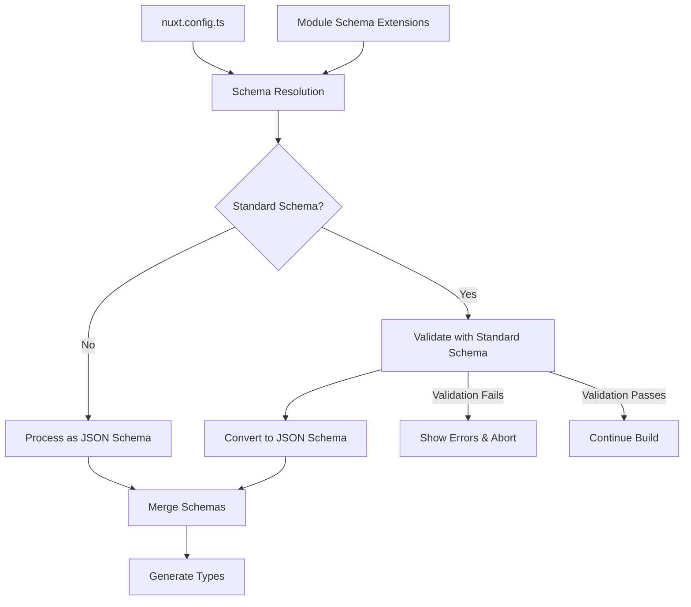

# Nuxt Standard Schema Support

This implementation adds support for [Standard Schema](https://github.com/standard-schema/standard-schema) validation to Nuxt 3, enabling build-time configuration validation using popular libraries like Zod, Valibot, and ArkType.

## 🚀 Features

- **App-level validation**: Validate your `nuxt.config.ts` using `$schema`
- **Module-level validation**: Modules can provide Standard Schema validation for their options
- **Partial validation**: Only validate specific configuration sections
- **Build-time errors**: Detailed validation errors during development and build
- **Multiple libraries**: Support for Zod, Valibot, ArkType, and other Standard Schema compatible libraries

## 📋 Implementation Details

### Core Changes

1. **Type Extensions** (`packages/schema/src/types/config.ts`)
   - Extended `NuxtConfig['$schema']` to accept `StandardSchemaV1`
   - Added support for both JSON Schema and Standard Schema

2. **Utility Functions** (`packages/schema/src/utils/standard-schema.ts`)
   - `isStandardSchema()`: Type guard to detect Standard Schema objects
   - `standardSchemaToJsonSchema()`: Convert Standard Schema to JSON Schema
   - `validateWithStandardSchema()`: Validate configuration against Standard Schema
   - `formatStandardSchemaIssue()`: Format validation errors for display

3. **Schema Resolution** (`packages/nuxt/src/core/schema.ts`)
   - Enhanced schema resolution to handle both JSON Schema and Standard Schema
   - Added validation during build process
   - Support for module-provided Standard Schemas

4. **Kit Extensions** (`packages/kit/src/loader/schema.ts`)
   - Added `extendNuxtStandardSchema()` for module authors
   - Allows modules to validate their configuration options

## 🎯 Usage Examples

### App-level Validation

```ts
// nuxt.config.ts
import { object, string, number } from 'valibot'

export default defineNuxtConfig({
  runtimeConfig: {
    apiKey: process.env.API_KEY,
    timeout: 5000
  },
  
  $schema: object({
    runtimeConfig: object({
      apiKey: string(),
      timeout: number()
    })
  })
})
```

### Module-level Validation

```ts
// modules/my-module.ts
import { defineNuxtModule } from '@nuxt/kit'
import { extendNuxtStandardSchema } from '@nuxt/kit'
import { z } from 'zod'

export default defineNuxtModule({
  setup(_, nuxt) {
    extendNuxtStandardSchema('myModule', z.object({
      endpoint: z.string().url(),
      timeout: z.number().positive()
    }))
  }
})
```

## 🔧 Validation Behavior

### Partial Validation Semantics

- **Only defined keys are validated**: Keys not in your schema are ignored
- **Extra keys allowed by default**: No errors for additional configuration
- **Strict mode support**: Use library-specific strict modes to disallow extra keys
- **Deep path validation**: Supports nested object validation

### Error Reporting

When validation fails, you'll see detailed error messages:

```bash
❌ [Nuxt Schema] Standard Schema validation failed:
  1. runtimeConfig.apiKey: Expected string, received number (123)
  2. runtimeConfig.timeout: Number must be greater than 0
```

## 🏗️ Architecture



## 📚 Supported Libraries

Any library implementing the [Standard Schema specification](https://github.com/standard-schema/standard-schema):

- **[Zod](https://zod.dev/)** - TypeScript-first schema validation
- **[Valibot](https://valibot.dev/)** - Modular and lightweight
- **[ArkType](https://arktype.io/)** - TypeScript's 1:1 validator
- **[Joi](https://joi.dev/)** - With Standard Schema adapter
- **[Yup](https://github.com/jquense/yup)** - With Standard Schema adapter

## 🧪 Testing

### Unit Tests

```bash
# Test Standard Schema utilities
npm test packages/schema/test/standard-schema.test.ts

# Test schema resolution
npm test packages/nuxt/test/schema.test.ts

# Test kit extensions  
npm test packages/kit/test/schema.test.ts
```

### Integration Tests

```bash
# Test with example project
cd examples/standard-schema-validation
npm install
npm run build  # Should validate configuration
```

### Error Scenarios

Test validation failures:

```ts
// This should fail validation
export default defineNuxtConfig({
  runtimeConfig: {
    apiKey: 123,  // ❌ Expected string
    timeout: -1   // ❌ Must be positive
  },
  
  $schema: z.object({
    runtimeConfig: z.object({
      apiKey: z.string(),
      timeout: z.number().positive()
    })
  })
})
```

## 🔍 Debugging

### Enable Verbose Logging

Set `DEBUG=nuxt:schema` to see detailed schema processing:

```bash
DEBUG=nuxt:schema npm run dev
```

### Schema Inspection

Check generated schema files:

```bash
# View merged JSON schema
cat .nuxt/schema/nuxt.schema.json

# View generated TypeScript definitions
cat .nuxt/schema/nuxt.schema.d.ts
```

## 🚧 Limitations

### Current Limitations

1. **JSON Schema Conversion**: Standard Schema → JSON Schema conversion is basic
2. **Performance**: Validation runs on every build (could be optimized)
3. **Error Context**: Limited source location information in errors

### Future Improvements

1. **Advanced Conversion**: Better Standard Schema → JSON Schema mapping
2. **Caching**: Cache validation results for better performance  
3. **IDE Integration**: Enhanced TypeScript integration
4. **Source Maps**: Better error location reporting

## 🤝 Contributing

### Adding New Features

1. **Extend utilities** in `packages/schema/src/utils/standard-schema.ts`
2. **Update resolution logic** in `packages/nuxt/src/core/schema.ts`
3. **Add kit helpers** in `packages/kit/src/loader/schema.ts`
4. **Update types** in `packages/schema/src/types/config.ts`

### Testing Changes

```bash
# Run all tests
npm test

# Test specific packages
npm run test:unit packages/schema
npm run test:integration

# Test with examples
cd examples/standard-schema-validation
npm run build
```

## 📖 References

- [RFC Issue #15592](https://github.com/nuxt/nuxt/issues/15592)
- [Standard Schema Specification](https://github.com/standard-schema/standard-schema)
- [Nuxt Safe Runtime Config Module](https://github.com/onmax/nuxt-safe-runtime-config)
- [JSON Schema Documentation](https://json-schema.org/)

## 🎉 Migration Guide

### From JSON Schema

```ts
// Before
$schema: {
  type: 'object',
  properties: {
    runtimeConfig: {
      type: 'object',
      properties: {
        apiKey: { type: 'string' }
      }
    }
  }
}

// After
$schema: z.object({
  runtimeConfig: z.object({
    apiKey: z.string()
  })
})
```

### For Module Authors

```ts
// Before (no validation)
export default defineNuxtModule({
  setup(options) {
    // Hope options are correct 🤞
  }
})

// After (with validation)
export default defineNuxtModule({
  setup(options, nuxt) {
    extendNuxtStandardSchema('myModule', MySchema)
    // Options are validated ✅
  }
})
``` 
